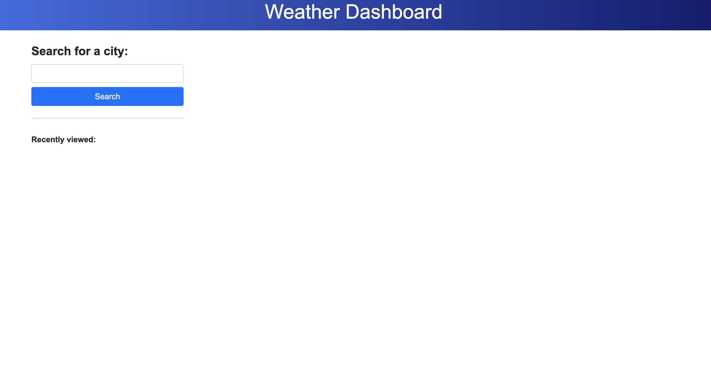
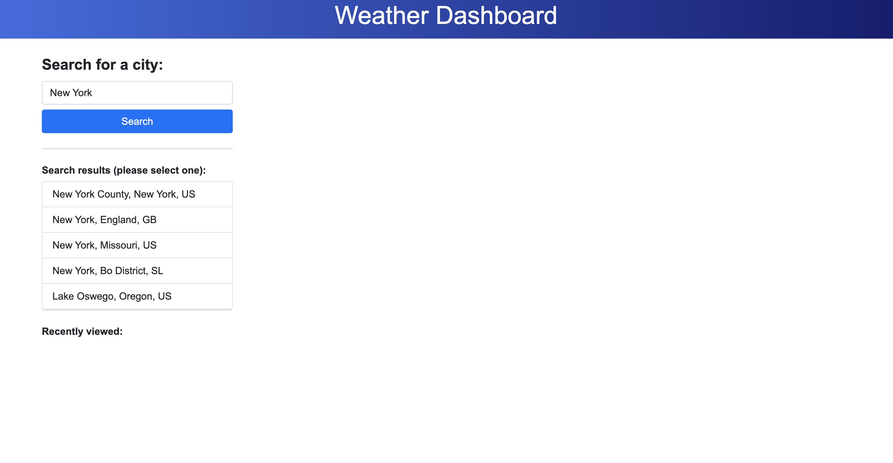
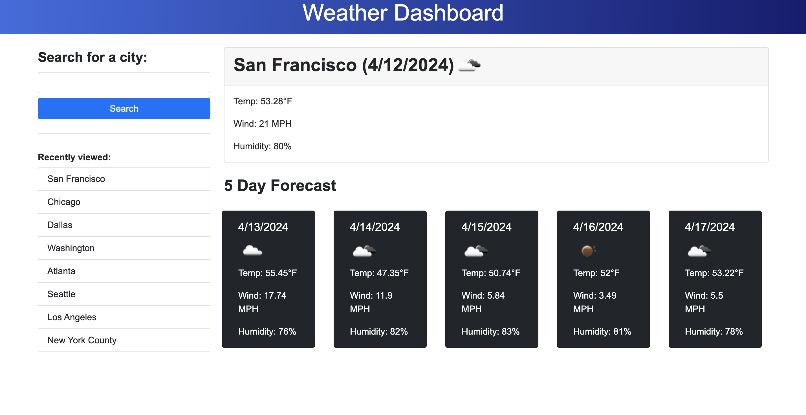

# Module 06 Challenge: Server-Side APIs / Weather Dashboard

## Description
This is the challenge for Module 06 of the coding bootcamp. This is a weather dashboard that allows a user to search for cities and get a 5-day forecast for those cities.

### User Story
```
AS A traveler
I WANT to see the weather outlook for multiple cities
SO THAT I can plan a trip accordingly
```

### Acceptance Criteria
```
GIVEN a weather dashboard with form inputs
WHEN I search for a city
THEN I am presented with current and future conditions for that city and that city is added to the search history
WHEN I view current weather conditions for that city
THEN I am presented with the city name, the date, an icon representation of weather conditions, the temperature, the humidity, and the wind speed
WHEN I view future weather conditions for that city
THEN I am presented with a 5-day forecast that displays the date, an icon representation of weather conditions, the temperature, the wind speed, and the humidity
WHEN I click on a city in the search history
THEN I am again presented with current and future conditions for that city
```

## Deployed Application
The project has been deployed [here](https://kristyyip.github.io/module-06-weather-dashboard/).

The user will first see a blank dashboard (if there's no cities in local storage) and has the option to search for a city.


After clicking the `Search` button, the user will then see a search results list of cities to choose from.


When a city is selected from either `Search results` or `Recently viewed`, the dashboard will generate the forecast for that city. For every city viewed, it will be added to the `Recently viewed` section.
